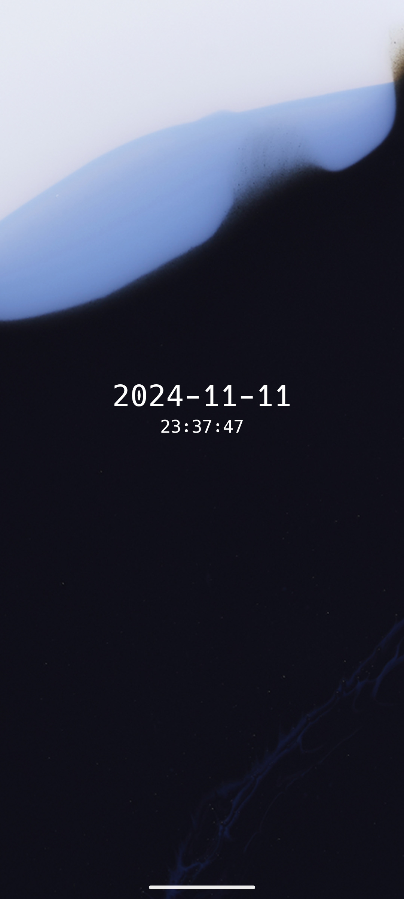
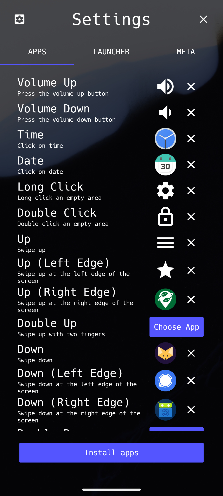
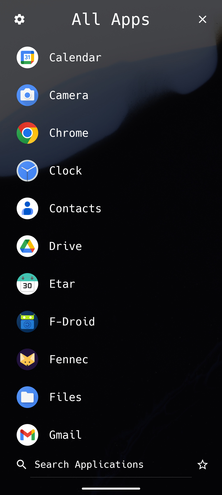
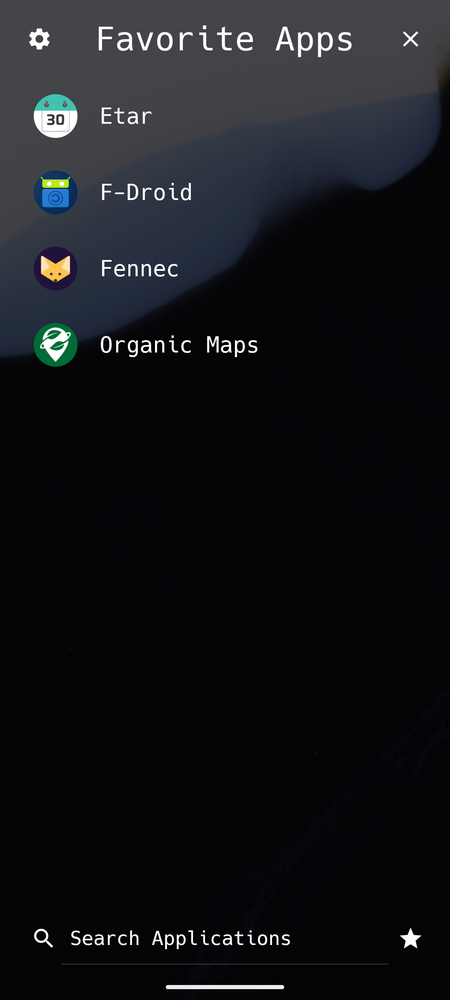
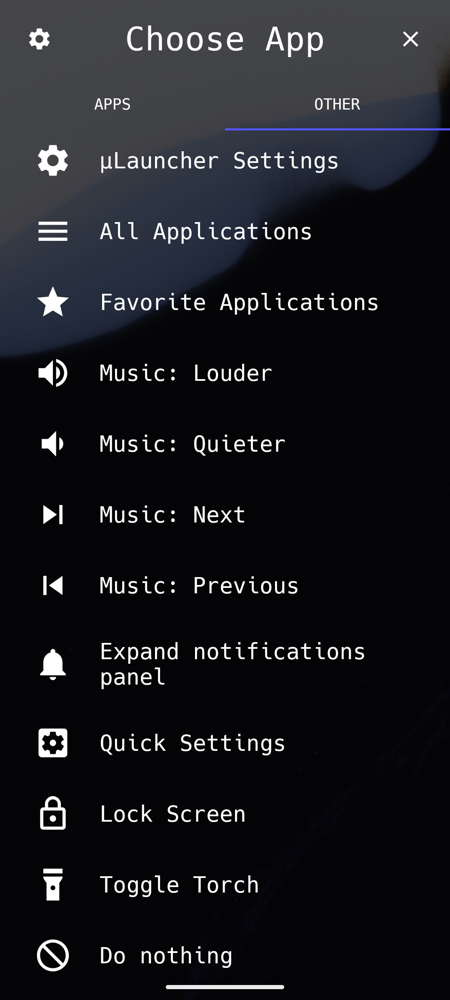

<!-- Shields from shields.io -->
[![][shield-release]][latest-release]

[![][shield-license]][license]
[][matrix]
[][discord]

# μLauncher

µLauncher is an Android home screen that lets you launch apps using swipe gestures and button presses.
It is *minimal, efficient and free of distraction*.

Your home screen only displays the date, time and a wallpaper.
Pressing back or swiping up (this can be configures) opens a list
of all installed apps, which can be searched efficiently.

This is a fork of [finnmglas's app Launcher][original-repo].

or download the latest APK from the [releases section](https://github.com/jrpie/Launcher/releases/latest).
You can also [get it on Google Play](https://play.google.com/store/apps/details?id=de.jrpie.android.launcher), but I don't recommend that.

     
     
     
     

## Contributing

There are several ways to contribute to this app:
* You can add or improve [translations][toolate].
      
* If you find a bug or have an idea for a new feature you can [join the Matrix chat][matrix] or open an [issue][issues]. Please note that I work on this project in my free time. Thus I might not respond immediately and not all ideas will be implemented.
* You can implement a new feature yourself:
  - Create a fork of this repository: [![][shield-gh-fork]][fork]
  - Create a new branch named `feature/<your feature>` of `fix/<your fix>` and commit your changes.
  - Open a new pull request.

See [BUILD.md](BUILD.md) for instructions how to build this project.

## Notable changes compared to [Finn's Launcher][original-repo]:

* Edge gestures: There is a setting to allow distinguishing swiping at the edges of the screen from swiping in the center.
* Compatible with [work profile](https://www.android.com/enterprise/work-profile/), so apps like [Shelter](https://gitea.angry.im/PeterCxy/Shelter) can be used.
* The home button now works as expected.

### Visual
* This app uses the system wallpaper instead of a custom solution.
* The font has been changed to [Hack][hack-font].
* Font Awesome Icons were replaced by Material icons.
* The gear button on the home screen was removed. Instead pressing back opens the list of applications and the app settings are accessible from there.

### Search
* The search algorithm was modified to prefer matches at the beginning of the app name, i.e. when searching for `"te"`, `"termux"` is sorted before `"notes"`.
* The search bar was moved to the bottom of the screen.

### Technical
* Small improvements to the gesture detection.
* Different apps set as default.
* Package name was changed to `de.jrpie.android.launcher` to avoid clashing with the original app.
* Dropped support for API < 21 (i.e. pre Lollypop)
* Some refactoring
---
---
  [hack-font]: https://sourcefoundry.org/hack/
  [original-repo]: https://github.com/finnmglas/Launcher
  [toolate]: https://toolate.othing.xyz/projects/jrpie-launcher/
  [issues]: https://github.com/jrpie/Launcher/issues/
  [fork]: https://github.com/jrpie/Launcher/fork/

<!-- Download links / stores -->

  [store-googleplay]: https://play.google.com/store/apps/details?id=de.jrpie.android.launcher
  [store-googleplay-badgecampain]: https://play.google.com/store/apps/details?id=de.jrpie.android.launcher&pcampaignid=pcampaignidMKT-Other-global-all-co-prtnr-py-PartBadge-Mar2515-1
  [store-fdroid]: https://f-droid.org/packages/de.jrpie.android.launcher/

<!-- Shields and Badges -->

  [shield-release]: https://img.shields.io/github/v/release/jrpie/Launcher?style=flat
  [latest-release]: https://github.com/jrpie/Launcher/releases/latest
  [shield-contribute]: https://img.shields.io/badge/contributions-welcome-007ec6.svg?style=flat
  [shield-license]: https://img.shields.io/badge/license-MIT-007ec6?style=flat

  [shield-gh-watch]: https://img.shields.io/github/watchers/jrpie/Launcher?label=Watch&style=social
  [shield-gh-star]: https://img.shields.io/github/stars/jrpie/Launcher?label=Star&style=social
  [shield-gh-fork]: https://img.shields.io/github/forks/jrpie/Launcher?label=Fork&style=social
  [matrix]: https://s.jrpie.de/launcher-matrix
  [discord]: https://s.jrpie.de/launcher-discord

<!-- Helpful resources -->

  [license]: https://github.com/jrpie/Launcher/blob/master/LICENSE
